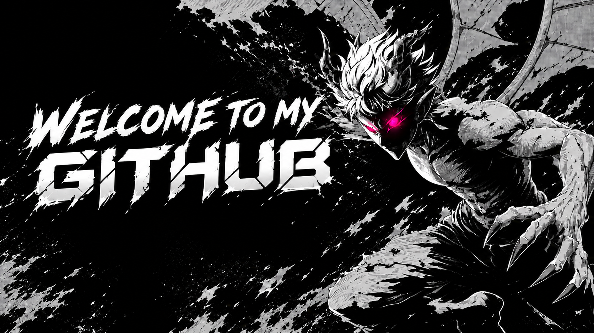

<!-- Simpan banner yang sudah dibuat ke repo kamu sebagai: assets/banner.png -->
<p align="center">
  
</p>
<div align="center">


<h1 align="center">
  Hello World! I'm Joshua Radit 👋
</h1>


</div>

## 🧑‍💻 About Me

- 🔭 **Currently exploring:** New things in technology
- 🌱 **Currently learning:** Web Development
- 💻 **Interested in:** HTML, CSS, JavaScript, PHP & Laravel
- 🛠️ **Building:** Projects to improve my coding skills
- 🎯 **Goal:** Always learning and becoming a better developer
  <br>

## <center> 💻Want to master :

<p align="center">
  
</p>
<br>
<p align="center"> <a href="https://github.com/JoshuaRdt">  </a> </p>
<p align="center">
  
  
</p>
<p align="center">
  
</div>

<!-- ==================== ADDITIONAL SECTION ==================== -->

## 🖥️ What I'm Currently Learning

```text
🌱 Learning Web Development
💻 Building personal projects
🔍 Exploring new technologies
🧠 Improving programming skills
🚀 Preparing for bigger projects
```

---

## 💡 Developer Mindset

> Start by thinking about the problem, not by jumping straight to the code.

<p align="center">
  
</p>

---


<p align="center">


</p>
<p align="center">
<p align="center">


</p> 

</p>

<br> <p align="center">


